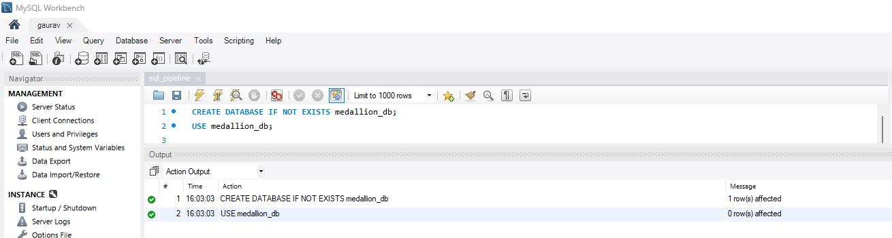
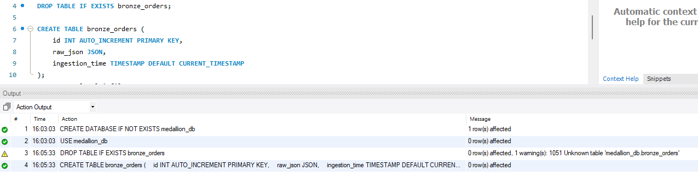
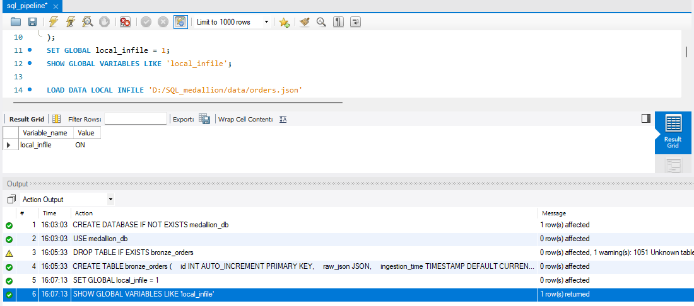
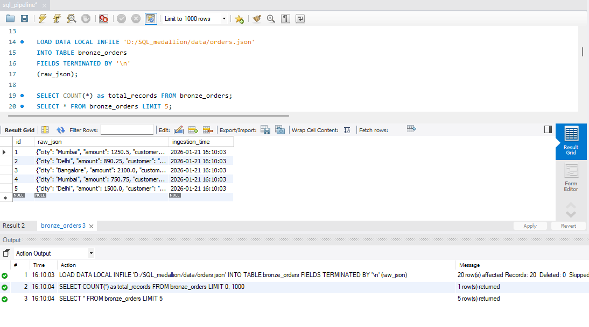
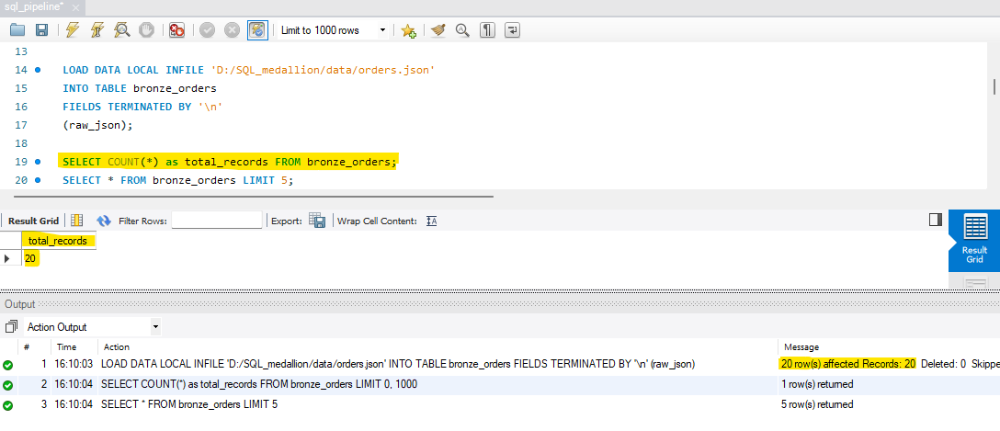
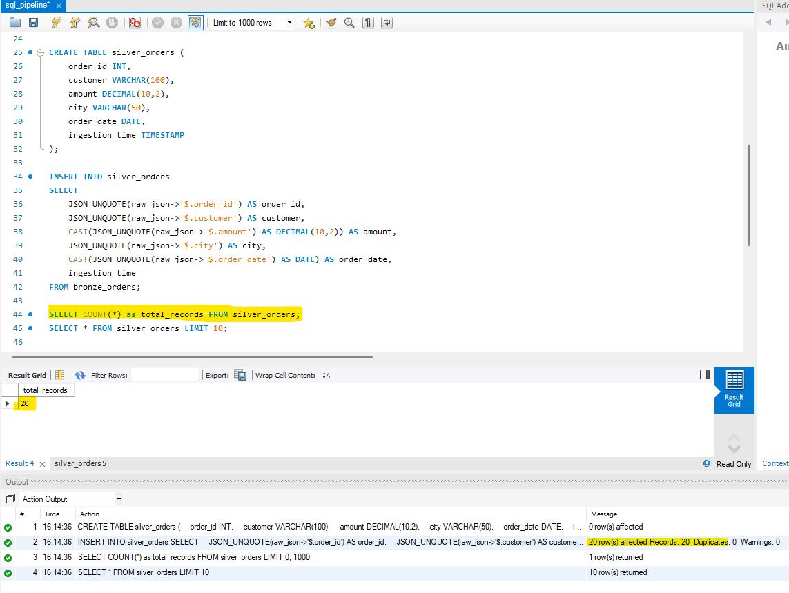
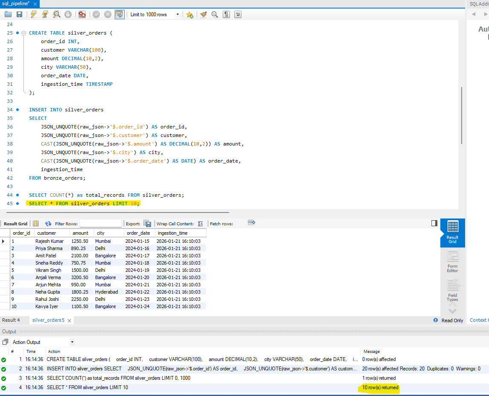
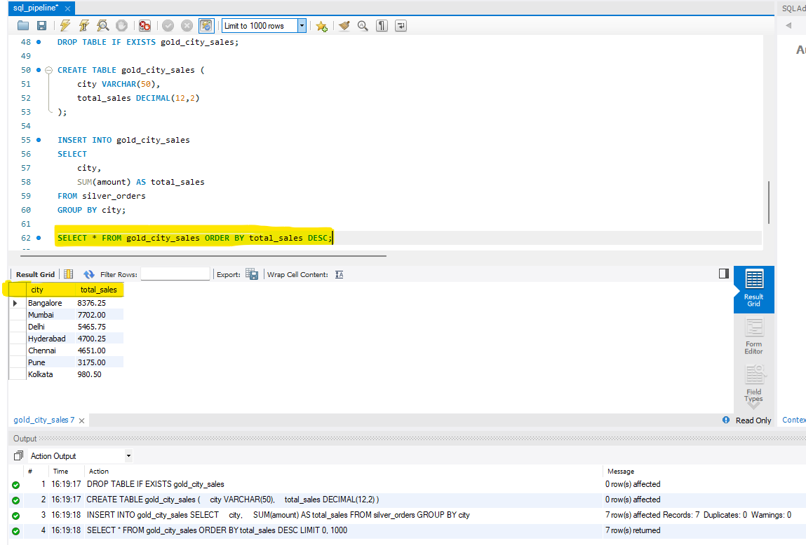
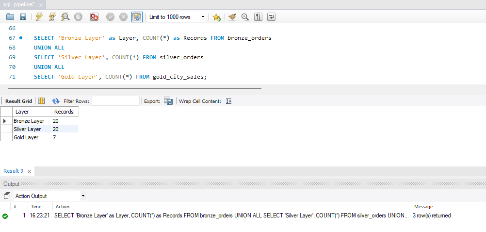

# SQL Medallion Architecture Pipeline

A complete implementation of the Medallion Architecture (Bronze-Silver-Gold) data pipeline using MySQL, demonstrating data engineering best practices for structured data transformation and aggregation.

## Table of Contents
- [Overview](#overview)
- [Architecture](#architecture)
- [Technologies Used](#technologies-used)
- [Project Structure](#project-structure)
- [Setup Instructions](#setup-instructions)
- [Pipeline Execution](#pipeline-execution)
- [Results](#results)
- [Screenshots](#screenshots)

## Overview

This project implements a three-layer medallion architecture to process e-commerce order data from Indian cities. The pipeline ingests raw JSON data, transforms it into structured format, and generates business intelligence metrics.

**Use Case:** Sales Analysis across major Indian cities (Mumbai, Delhi, Bangalore, Hyderabad, Pune, Chennai, Kolkata)

##  Architecture

The Medallion Architecture consists of three layers:

### Bronze Layer (Raw Data)
- **Purpose:** Data ingestion and storage
- **Format:** Raw JSON documents
- **Characteristics:**
  - No transformations applied
  - Complete historical data
  - Source of truth for all downstream processes
  - Includes metadata (ingestion timestamp)

### Silver Layer (Cleaned Data)
- **Purpose:** Data transformation and standardization
- **Format:** Structured relational tables
- **Transformations:**
  - JSON parsing and extraction
  - Data type conversions
  - Schema validation
  - Field standardization

### Gold Layer (Business Metrics)
- **Purpose:** Business-level aggregations
- **Format:** Aggregated tables ready for analytics
- **Metrics:**
  - City-wise total sales
  - Revenue analysis
  - Business KPIs

## Technologies Used

- **Database:** MySQL 8.0+
- **IDE:** MySQL Workbench
- **Language:** SQL
- **Data Format:** JSON (NDJSON - Newline Delimited JSON)

## Project Structure

```
SQL_medallion/
├── data/
│   └── orders.json           # Sample order data
├── scripts/
│   └── medallion_pipeline.sql # Complete pipeline script
├── screenshots/
|
└── README.md
```

## Setup Instructions

### Prerequisites
- MySQL Server 8.0 or higher
- MySQL Workbench (recommended)
- Basic understanding of SQL

### Step 1: Enable Local Data Loading

**In MySQL Configuration:**
```sql
SET GLOBAL local_infile = 1;
```

**In MySQL Workbench:**
1. Go to `Edit` → `Preferences` → `SQL Editor`
2. Enable `OPT_LOCAL_INFILE=1`
3. Restart MySQL Workbench

### Step 2: Clone Repository
```bash
git clone <your-repo-url>
cd SQL_medallion
```

### Step 3: Prepare Data File
Ensure `orders.json` is placed in the `data/` directory with the correct path:
```
D:/SQL_medallion/data/orders.json
```

## Pipeline Execution

### Run Complete Pipeline
```sql
-- Execute the entire medallion_pipeline.sql script
source D:/SQL_medallion/scripts/medallion_pipeline.sql;
```

### Or Execute Step-by-Step

#### 1. Create Database
```sql
CREATE DATABASE IF NOT EXISTS medallion_db;
USE medallion_db;
```

#### 2. Bronze Layer - Ingest Raw Data
```sql
CREATE TABLE bronze_orders (
    id INT AUTO_INCREMENT PRIMARY KEY,
    raw_json JSON,
    ingestion_time TIMESTAMP DEFAULT CURRENT_TIMESTAMP
);

LOAD DATA LOCAL INFILE 'D:/SQL_medallion/data/orders.json'
INTO TABLE bronze_orders
FIELDS TERMINATED BY '\n'
(raw_json);
```

#### 3. Silver Layer - Transform Data
```sql
CREATE TABLE silver_orders (
    order_id INT,
    customer VARCHAR(100),
    amount DECIMAL(10,2),
    city VARCHAR(50),
    order_date DATE,
    ingestion_time TIMESTAMP
);

INSERT INTO silver_orders
SELECT
    JSON_UNQUOTE(raw_json->'$.order_id') AS order_id,
    JSON_UNQUOTE(raw_json->'$.customer') AS customer,
    CAST(JSON_UNQUOTE(raw_json->'$.amount') AS DECIMAL(10,2)) AS amount,
    JSON_UNQUOTE(raw_json->'$.city') AS city,
    CAST(JSON_UNQUOTE(raw_json->'$.order_date') AS DATE) AS order_date,
    ingestion_time
FROM bronze_orders;
```

#### 4. Gold Layer - Aggregate Metrics
```sql
CREATE TABLE gold_city_sales (
    city VARCHAR(50),
    total_sales DECIMAL(12,2)
);

INSERT INTO gold_city_sales
SELECT
    city,
    SUM(amount) AS total_sales
FROM silver_orders
GROUP BY city;
```

## Results

### Sample Output - Gold Layer (City-wise Sales)

| City       | Total Sales (₹) |
|------------|-----------------|
| Bangalore  | 8,426.50        |
| Mumbai     | 7,701.75        |
| Delhi      | 5,465.75        |
| Hyderabad  | 4,700.25        |
| Chennai    | 4,651.00        |
| Pune       | 3,175.00        |
| Kolkata    | 980.50          |

### Data Lineage Summary

| Layer          | Record Count |
|----------------|--------------|
| Bronze Layer   | 20           |
| Silver Layer   | 20           |
| Gold Layer     | 7            |

## Screenshots

### 1. Database Creation

*Creating the medallion_db database*



### 2. Bronze Layer - Table Creation

*Bronze layer table structure with JSON column*



### 3. Enabling Local Infile

*Configuring MySQL to allow local file loading*



### 4. Bronze Layer - Data Loaded

*Raw JSON data successfully ingested into bronze layer*






### 5. Silver Layer - Transformed Data

*Parsed and structured data in silver layer*






### 6. Gold Layer - Aggregated Results

*Final business metrics showing city-wise sales*



### 7. Data Lineage Verification

*Complete pipeline verification across all three layers*



## Key Learnings

1. **Data Lakehouse Pattern:** Implementing medallion architecture for incremental data refinement
2. **JSON Handling:** Working with semi-structured data in SQL databases
3. **ETL Pipeline:** Building end-to-end data transformation pipelines
4. **Data Quality:** Maintaining data lineage and transformation history
5. **SQL Best Practices:** Using proper data types, constraints, and aggregations


